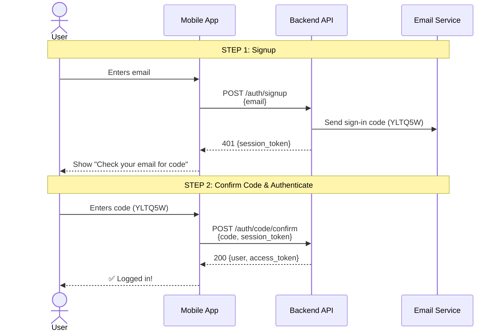
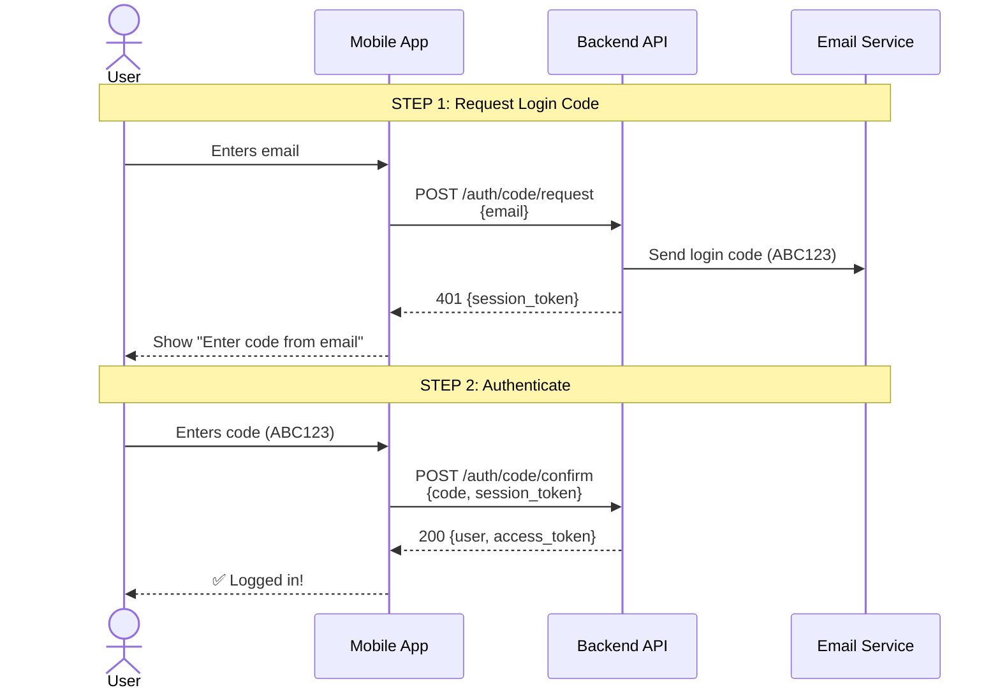

# Passwordless Authentication API Guide

Complete guide for implementing passwordless authentication with Django-Allauth Headless in your mobile app or web frontend.

## Overview

This project uses **true passwordless authentication** - no passwords required anywhere! Users authenticate using OTP codes sent to their email.

---

## Sequence Diagrams

### New User: Signup + Login Flow



---

### Existing User: Login Flow



---

## Flow Comparison

| Step | New User | Existing User |
|------|----------|---------------|
| 1 | POST /auth/signup | POST /auth/code/request |
| 2 | POST /auth/code/confirm ✅ | POST /auth/code/confirm ✅ |

**Key Takeaway:** Both flows are 2 steps and end with `/auth/code/confirm`

### Important Concepts

**Single Code for Signup**

With the current configuration (`ACCOUNT_EMAIL_VERIFICATION = "mandatory"` + code-based verification), django-allauth is smart enough to:

- **Combine email verification + authentication** into ONE code during signup
- The signup code both verifies the email AND logs you in!
- No need to request a separate login code after signup

> ✅ **Key Point**: The sign-in code from signup DOES authenticate new users. You can use it directly with `/auth/code/confirm`.

---

## API Endpoints

All endpoints are prefixed with `/api/_allauth/app/v1/` for mobile apps.

### Base URL
```
Local: http://localhost:8000/api/_allauth/app/v1/
Production: https://your-domain.com/api/_allauth/app/v1/
```

---

## Complete Flows

### Flow 1: New User Signup + Login (2 Steps)

#### Step 1: User Enters Email → Call Signup

**Request:**
```http
POST /api/_allauth/app/v1/auth/signup
Content-Type: application/json

{
  "email": "user@example.com"
}
```

**Response (401):**
```json
{
  "status": 401,
  "data": {
    "flows": [
      {
        "id": "login_by_code",
        "is_pending": true
      }
    ]
  },
  "meta": {
    "is_authenticated": false,
    "session_token": "signup_session_abc123..."
  }
}
```

**What Happens:**
- User account is created
- Email sent with **sign-in code** (e.g., `YLTQ5W`) that both verifies email AND authenticates
- Session token returned for next step
- The response shows `login_by_code` is pending, meaning you can use the code immediately

---

#### Step 2: User Enters Sign-In Code → Authenticate

**Request:**
```http
POST /api/_allauth/app/v1/auth/code/confirm
Content-Type: application/json
X-Session-Token: signup_session_abc123...

{
  "code": "YLTQ5W"
}
```

**Success Response (200):**
```json
{
  "status": 200,
  "data": {
    "user": {
      "id": 7,
      "display": "user@example.com",
      "email": "user@example.com",
      "has_usable_password": false
    },
    "methods": [
      {
        "method": "code",
        "at": 1762429324.19,
        "email": "user@example.com"
      }
    ]
  },
  "meta": {
    "is_authenticated": true,
    "session_token": "authenticated_session_def456...",
    "access_token": "eyJ0eXAiOiJKV1QiLCJhbGc..."
  }
}
```

**What Happens:**
- User's email is verified ✅
- User is authenticated ✅
- New authenticated session token returned
- Access token provided for API requests

---

### Flow 2: Existing User Login

For users who already have an account, the flow is simpler:

#### Step 1: Request Login Code

**Request:**
```http
POST /api/_allauth/app/v1/auth/code/request
Content-Type: application/json

{
  "email": "existing@example.com"
}
```

**Response:** Same as new user Step 3

---

#### Step 2: Confirm Login Code

**Request:**
```http
POST /api/_allauth/app/v1/auth/code/confirm
Content-Type: application/json
X-Session-Token: {from_step_1}

{
  "code": "ABC123"
}
```

**Response:** Same as new user Step 4

---

## Session Management

### Check Authentication Status

**Request:**
```http
GET /api/_allauth/app/v1/auth/session
X-Session-Token: authenticated_session_def456...
```

**Response (Authenticated):**
```json
{
  "status": 200,
  "data": {
    "user": {
      "id": 7,
      "email": "user@example.com",
      "has_usable_password": false
    }
  },
  "meta": {
    "is_authenticated": true,
    "session_token": "authenticated_session_def456...",
    "access_token": "eyJ0eXAiOiJKV1QiLCJhbGc..."
  }
}
```

---

### Logout

**Request:**
```http
DELETE /api/_allauth/app/v1/auth/session
X-Session-Token: authenticated_session_def456...
```

**Response:**
```json
{
  "status": 200,
  "meta": {
    "is_authenticated": false
  }
}
```

---

## Error Handling

### Common Errors

#### Invalid Code
```json
{
  "type": "validation_error",
  "errors": [
    {
      "code": "invalid",
      "detail": "Invalid code.",
      "attr": "code"
    }
  ]
}
```

#### Expired Code
```json
{
  "type": "validation_error",
  "errors": [
    {
      "code": "expired",
      "detail": "Code has expired.",
      "attr": "code"
    }
  ]
}
```

#### Email Not Found (during code request)
```json
{
  "status": 401,
  "errors": [
    {
      "code": "account_inactive",
      "message": "Account does not exist."
    }
  ]
}
```

**Solution**: Call `/auth/signup` first

---

## Mobile App Implementation Example

### Swift (iOS)

```swift
// Step 1: Request login code
func requestLoginCode(email: String) async throws {
    let url = URL(string: "\(baseURL)/auth/code/request")!
    var request = URLRequest(url: url)
    request.httpMethod = "POST"
    request.setValue("application/json", forHTTPHeaderField: "Content-Type")

    let body = ["email": email]
    request.httpBody = try JSONEncoder().encode(body)

    let (data, _) = try await URLSession.shared.data(for: request)
    let response = try JSONDecoder().decode(CodeRequestResponse.self, from: data)

    // Store session token for next step
    UserDefaults.standard.set(response.meta.sessionToken, forKey: "sessionToken")
}

// Step 2: Confirm code
func confirmCode(_ code: String) async throws -> User {
    let url = URL(string: "\(baseURL)/auth/code/confirm")!
    var request = URLRequest(url: url)
    request.httpMethod = "POST"
    request.setValue("application/json", forHTTPHeaderField: "Content-Type")

    // Get session token from Step 1
    if let sessionToken = UserDefaults.standard.string(forKey: "sessionToken") {
        request.setValue(sessionToken, forHTTPHeaderField: "X-Session-Token")
    }

    let body = ["code": code]
    request.httpBody = try JSONEncoder().encode(body)

    let (data, _) = try await URLSession.shared.data(for: request)
    let response = try JSONDecoder().decode(AuthResponse.self, from: data)

    // Store authenticated session token
    UserDefaults.standard.set(response.meta.sessionToken, forKey: "sessionToken")
    UserDefaults.standard.set(response.meta.accessToken, forKey: "accessToken")

    return response.data.user
}
```

---

### Kotlin (Android)

```kotlin
// Step 1: Request login code
suspend fun requestLoginCode(email: String): String {
    val response = apiService.requestLoginCode(
        CodeRequest(email = email)
    )
    // Return session token for next step
    return response.meta.sessionToken
}

// Step 2: Confirm code
suspend fun confirmCode(sessionToken: String, code: String): AuthResponse {
    val response = apiService.confirmCode(
        sessionToken = sessionToken,
        request = CodeConfirm(code = code)
    )

    // Store tokens
    preferences.edit()
        .putString("session_token", response.meta.sessionToken)
        .putString("access_token", response.meta.accessToken)
        .apply()

    return response
}
```

---

### React Native / JavaScript

```javascript
// Step 1: Request login code
async function requestLoginCode(email) {
  const response = await fetch(`${API_URL}/auth/code/request`, {
    method: 'POST',
    headers: { 'Content-Type': 'application/json' },
    body: JSON.stringify({ email })
  });

  const data = await response.json();
  // Store session token
  await AsyncStorage.setItem('sessionToken', data.meta.session_token);
  return data;
}

// Step 2: Confirm code
async function confirmCode(code) {
  const sessionToken = await AsyncStorage.getItem('sessionToken');

  const response = await fetch(`${API_URL}/auth/code/confirm`, {
    method: 'POST',
    headers: {
      'Content-Type': 'application/json',
      'X-Session-Token': sessionToken
    },
    body: JSON.stringify({ code })
  });

  const data = await response.json();

  // Store authenticated tokens
  await AsyncStorage.setItem('sessionToken', data.meta.session_token);
  await AsyncStorage.setItem('accessToken', data.meta.access_token);

  return data.data.user;
}
```

---

## Configuration Reference

Current settings in `config/settings/base.py`:

```python
# Passwordless Authentication
ACCOUNT_LOGIN_METHODS = {"email"}
ACCOUNT_SIGNUP_FIELDS = ["email*"]  # No password required
ACCOUNT_LOGIN_BY_CODE_ENABLED = True  # Enable login by code
ACCOUNT_LOGIN_BY_CODE_REQUIRED = True  # Require code (no password fallback)
ACCOUNT_EMAIL_VERIFICATION = "mandatory"  # Email must be verified
ACCOUNT_EMAIL_VERIFICATION_BY_CODE_ENABLED = True  # Use OTP codes
ACCOUNT_PASSWORD_REQUIRED = False  # No password needed
```

---

## FAQ

### Q: Does signup send a code that logs me in?

**A:** YES! With the current configuration, signup sends a **sign-in code** that both verifies your email AND authenticates you. You can use it directly with `/auth/code/confirm` - no need to request a separate login code.

### Q: What's the difference between new user and existing user flows?

**A:** Both are 2 steps:
- **New users**: `/auth/signup` → `/auth/code/confirm`
- **Existing users**: `/auth/code/request` → `/auth/code/confirm`

The only difference is the first endpoint - both flows end with confirming the code.

### Q: How long are codes valid?

**A:** By default, codes expire after 3 minutes. This is configurable via `ACCOUNT_LOGIN_CODE_TIMEOUT`.

### Q: Can I skip email verification?

**A:** No. With `ACCOUNT_EMAIL_VERIFICATION_BY_CODE_ENABLED = True`, you must set `ACCOUNT_EMAIL_VERIFICATION = "mandatory"`. However, the signup code serves dual purpose (verification + authentication), so there's no extra step.

### Q: What if I try to login before verifying my email?

**A:** The `/auth/code/request` endpoint will only work for verified accounts. New users must use the sign-in code from signup first.

---

## Testing in Development

### View Email Codes in Console

In local development, emails are printed to console:

```bash
# View Django logs
docker compose -f docker-compose.local.yml logs django --tail=50

# Extract codes
docker compose -f docker-compose.local.yml logs django | grep -E "[A-Z0-9]{6}"
```

### Example Code Output
```
Subject: [example.com] Sign-In Code
Your sign-in code: YLTQ5W
```

---

## Security Considerations

1. **Codes are single-use** - Each code can only be used once
2. **Time-limited** - Codes expire after 3 minutes by default
3. **Rate limiting** - Prevent abuse with request throttling
4. **HTTPS required** - Always use HTTPS in production
5. **Session tokens** - Keep session tokens secure, stored in secure storage

---

## Support

For issues or questions:
- Check Django-Allauth docs: https://docs.allauth.org/en/latest/headless/
- Review project settings: `config/settings/base.py`
- Contact backend team

---

**Last Updated:** November 6, 2025
**Django-Allauth Version:** 65.13.0
